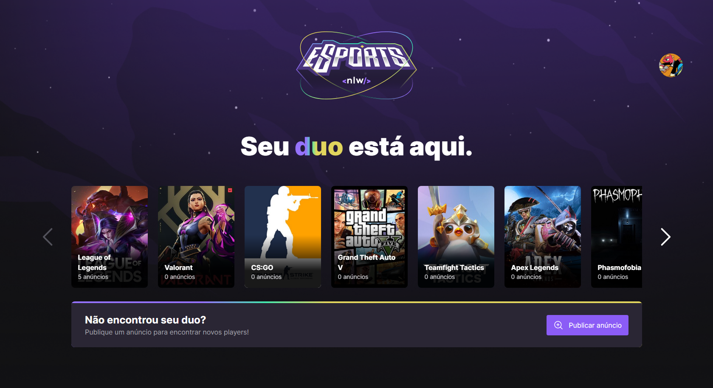

# NLW Esports

## O seu duo 💏 está aqui! 

O NLW Esports é uma plataforma web e mobile de anúncios de gamers a procura de alguém para jogar nos horários disponiveis.

## Tecnologias utilizadas na construção 🤖

- React
- Node.js
- React Native
- Expo
- Typescript
- Express
- MySQL
- Prisma
- Tailwind
- PhosporIcons
- Radix UI
- OAuth2 (Discord)
- JWT

## Ultimas implementações 🚀

### Autenticação
    - OAuth2 (Discord)
    - JWT para usuários padrão

### Layout
    - Responsividade
    - Carousel na lista de games

## O que vem ai? 🛠

- !!EM BREVE!!: Deploy no Heroku.
- Autorização (Somente usuários cadastrados podem ver informações de contato de outros usuários)
- Criação de anúncios com web
- My ads (Sua tela de gestão de ads.);
